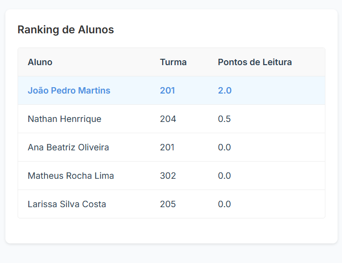
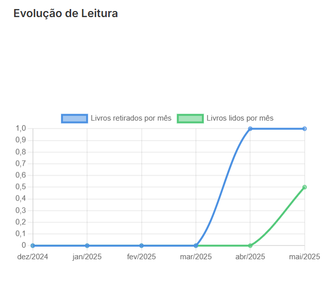

# 📚 Bibliotech - Sistema de Gestão de Biblioteca Escolar

<div align="center">

**Uma solução SAAS moderna para gestão completa de bibliotecas escolares**

[]()
[]()
[]()
[]()
[]()

[**🚀 Demo**](https://bibliotech-demo.vercel.app) • [**📖 Documentação**](#documentação) • [**🐛 Reportar Bug**](https://github.com/seu-usuario/bibliotech/issues) • [**💡 Solicitar Feature**](https://github.com/seu-usuario/bibliotech/issues)

</div>

---

## 👨‍💻 **Desenvolvedor**

**Este projeto foi desenvolvido integralmente por [Gustavo](https://github.com/seu-usuario), incluindo:**

- ✅ **Arquitetura completa** do sistema
- ✅ **Frontend React/TypeScript** com todas as funcionalidades
- ✅ **Backend Firebase** com autenticação e banco de dados
- ✅ **Design responsivo** e interface moderna
- ✅ **Sistema de autenticação** multi-nível
- ✅ **Gestão completa** de livros, usuários e empréstimos
- ✅ **Dashboard analytics** com métricas detalhadas
- ✅ **Sistema de notificações** e relatórios
- ✅ **Deploy e configuração** de produção

---

## 🎯 **Sobre o Projeto**

**Bibliotech** é uma plataforma SaaS completa para gestão de bibliotecas escolares, desenvolvida com foco na experiência do usuário e métricas de desempenho. A solução oferece controle total sobre acervo, empréstimos, usuários e análises de leitura, contribuindo para o desenvolvimento educacional dos alunos.

<div align="center">


*Interface principal do Bibliotech em desktop*

.png)
*Interface responsiva do Bibliotech em dispositivos móveis*

</div>

### ✨ **Principais Diferenciais**

- 📊 **Dashboard Analytics** - Métricas detalhadas de leitura e engajamento
- 🎯 **Gamificação** - Sistema de pontuação para motivar alunos
- 📱 **Design Responsivo** - Interface otimizada para todos os dispositivos
- 🔒 **Multi-tenancy** - Suporte a múltiplas escolas
- ⚡ **Performance** - Carregamento rápido com lazy loading
- 🎨 **Interface Moderna** - Design atrativo com animações fluidas
- 📈 **Relatórios Avançados** - Análises detalhadas de performance

---

## 🚀 **Funcionalidades Implementadas**

### 👥 **Sistema de Autenticação**
- **Firebase Auth** integrado com múltiplos provedores
- **Recuperação de senha** automática
- **Proteção de rotas** baseada em permissões
- **Sessões persistentes** com refresh automático

### 📚 **Gerenciamento de Acervo**
- **Cadastro completo** de livros com metadados detalhados
- **Sistema de busca avançada** com filtros por título, autor, categoria
- **Categorização inteligente** com tags e gêneros
- **Controle de estoque** e localização física
- **Upload de imagens** para capas dos livros
- **Edição e exclusão** com confirmações

### 👨‍🎓 **Gestão de Estudantes**
- **Cadastro de alunos** com dados completos
- **Vinculação por turma** e série
- **Histórico de empréstimos** individual
- **Dashboard personalizado** para cada aluno
- **Sistema de pontuação** baseado em leituras

### 👨‍💼 **Gestão de Funcionários**
- **Cadastro de bibliotecários** e administradores
- **Controle de permissões** granular
- **Dashboard administrativo** com métricas
- **Gestão de equipe** e responsabilidades

### 🔄 **Sistema de Empréstimos**
- **Workflow completo** de retirada e devolução
- **Controle de prazos** com notificações
- **Renovação automática** baseada em regras
- **Histórico detalhado** de transações
- **Sistema de multas** configurável
- **Confirmações visuais** para cada ação

### 📈 **Analytics & Relatórios**
- **Dashboard executivo** com KPIs em tempo real
- **Gráficos interativos** usando Chart.js
- **Análise de tendências** por período
- **Ranking de livros** mais populares
- **Performance por turma** e aluno
- **Taxa de conclusão** de leituras
- **Relatórios exportáveis** em múltiplos formatos

<div align="center">


*Dashboard com métricas de leitura*


*Análise detalhada de performance por turma*


*Relatórios e gráficos interativos*

</div>

### 🎨 **Interface e UX**
- **Design responsivo** para mobile, tablet e desktop
- **Animações fluidas** com Framer Motion
- **Temas personalizáveis** por instituição
- **Navegação intuitiva** com breadcrumbs
- **Feedback visual** para todas as ações
- **Loading states** e skeleton screens
- **Modais e confirmações** elegantes

## 🛠️ **Stack Tecnológica**

### **Frontend**
- **React 18** - Framework principal com hooks modernos
- **TypeScript** - Tipagem estática para maior confiabilidade
- **Styled Components** - CSS-in-JS para estilização modular
- **Framer Motion** - Animações e transições fluidas
- **Chart.js + React-Chartjs-2** - Visualização de dados
- **React Router v6** - Roteamento com lazy loading
- **React Hook Form** - Formulários performáticos
- **Heroicons** - Ícones modernos e consistentes
- **Date-fns** - Manipulação de datas

### **Backend & Infraestrutura**
- **Firebase v10+** - Backend as a Service completo
- **Firestore** - Banco de dados NoSQL escalável
- **Firebase Auth** - Autenticação segura multi-provedor
- **Firebase Storage** - Armazenamento de arquivos
- **Firebase Security Rules** - Regras de segurança
- **Vercel** - Deploy e hosting otimizado

### **Arquitetura e Padrões**
- **Context API** - Gerenciamento de estado global
- **Custom Hooks** - Lógica reutilizável
- **Component Composition** - Componentes modulares
- **Error Boundaries** - Tratamento de erros
- **Lazy Loading** - Carregamento sob demanda
- **Code Splitting** - Otimização de performance

---

## 🚀 **Quick Start**

### **Pré-requisitos**
```bash
Node.js 18+ 
npm 9+ ou yarn 1.22+
Git
Conta Firebase
```

### **Instalação**

1. **Clone o repositório**
```bash
git clone https://github.com/seu-usuario/bibliotech.git
cd bibliotech
```

2. **Instale as dependências**
```bash
npm install
# ou
yarn install
```

3. **Configure o Firebase**
- Crie um projeto no [Firebase Console](https://console.firebase.google.com)
- Ative Authentication, Firestore e Storage
- Configure as regras de segurança

4. **Configure as variáveis de ambiente**
```bash
cp .env.example .env.local
```

Edite o `.env.local` com suas credenciais do Firebase:
```env
REACT_APP_FIREBASE_API_KEY=sua_api_key
REACT_APP_FIREBASE_AUTH_DOMAIN=seu_projeto.firebaseapp.com
REACT_APP_FIREBASE_PROJECT_ID=seu_projeto_id
REACT_APP_FIREBASE_STORAGE_BUCKET=seu_projeto.appspot.com
REACT_APP_FIREBASE_MESSAGING_SENDER_ID=123456789
REACT_APP_FIREBASE_APP_ID=sua_app_id
```

5. **Execute o projeto**
```bash
npm start
# ou
yarn start
```

6. **Acesse a aplicação**
```
http://localhost:3000
```

---

## 🏗️ **Arquitetura do Projeto**

```
src/
├── components/          # Componentes reutilizáveis
│   ├── auth/           # Componentes de autenticação
│   ├── ui/             # Componentes base (Button, Modal, Loading)
│   ├── layout/         # Layout e navegação
│   ├── shared/         # Componentes compartilhados
│   ├── home/           # Componentes da página inicial
│   └── theme/          # Provedor de tema
├── pages/              # Páginas da aplicação
│   ├── auth/           # Login, recuperação de senha
│   ├── books/          # Gestão de livros
│   ├── students/       # Gestão de alunos
│   ├── staff/          # Gestão de funcionários
│   ├── loans/          # Sistema de empréstimos
│   ├── returns/        # Sistema de devoluções
│   ├── withdrawals/    # Sistema de retiradas
│   ├── dashboard/      # Dashboards administrativos
│   ├── settings/       # Configurações
│   └── student/        # Área do aluno
├── contexts/           # Context API (Auth, Settings, etc)
├── hooks/              # Custom hooks (useAsync, useLocalStorage)
├── services/           # Serviços e APIs (Firebase)
├── config/             # Configurações (Firebase, rotas)
├── constants/          # Constantes da aplicação
├── types/              # Definições TypeScript
├── styles/             # Estilos globais e temas
└── data/               # Dados de exemplo
```

---

## 🧪 **Testes e Qualidade**

```bash
# Executar todos os testes
npm run test

# Testes com coverage
npm run test -- --coverage

# Testes em modo watch
npm run test -- --watch

# Build de produção
npm run build

# Análise de bundle
npm run build -- --analyze
```

---

## 🚀 **Deploy**

### **Vercel (Recomendado)**
```bash
npm run build
npx vercel --prod
```

### **Netlify**
```bash
npm run build
# Faça upload da pasta build/
```

### **Firebase Hosting**
```bash
npm install -g firebase-tools
firebase login
firebase init hosting
npm run build
firebase deploy
```


## 🤝 **Contribuindo**

Contribuições são sempre bem-vindas! Veja como você pode ajudar:

1. **Fork o projeto**
2. **Crie sua feature branch** (`git checkout -b feature/AmazingFeature`)
3. **Commit suas mudanças** (`git commit -m 'Add some AmazingFeature'`)
4. **Push para a branch** (`git push origin feature/AmazingFeature`)
5. **Abra um Pull Request**

### **Padrões de Código**
- Use **TypeScript** para todos os novos arquivos
- Siga os padrões do **ESLint** configurado
- Escreva **testes** para novas funcionalidades
- Mantenha **commits semânticos**
- Documente **componentes complexos**

## 📄 **Licença**

Este projeto está sob a licença MIT. Veja o arquivo [LICENSE](LICENSE) para mais detalhes.

---

## 🆘 **Suporte**

### **Documentação**
- [📖 Guia do Usuário](docs/user-guide.md) *(em desenvolvimento)*
- [👨‍💻 Documentação da API](docs/api.md) *(em desenvolvimento)*
- [🏗️ Guia de Arquitetura](docs/architecture.md) *(em desenvolvimento)*


### **Enterprise**
Para soluções empresariais e suporte dedicado:
- 📧 **Email**: proton.hello.world@gmail.com
- 📞 **WhatsApp**: (51) 99718-8572
- 🌐 **Website**: [Proton Software](https://protonsoftware.tech)

---

<div align="center">

**Desenvolvido com ❤️ por [Gustavo](https://github.com/seu-usuario)**

⭐ **Se este projeto te ajudou, deixe uma estrela!** ⭐

**© 2024 Gustavo Almeida - Todos os direitos reservados**

</div> 