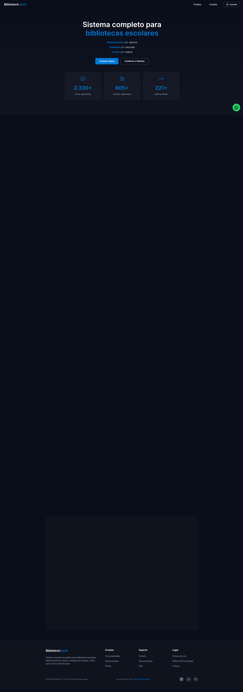
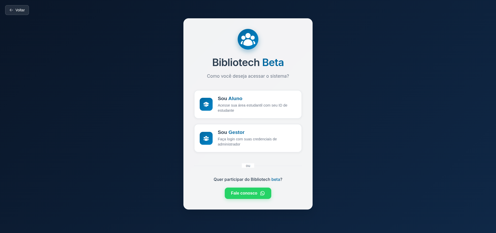
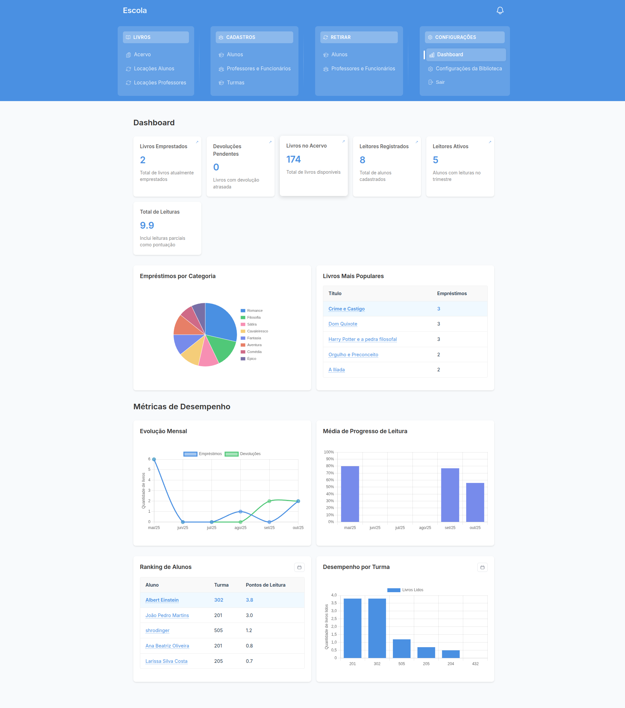
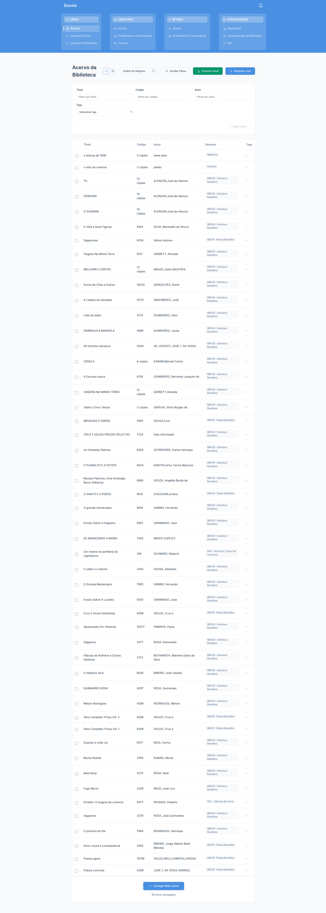
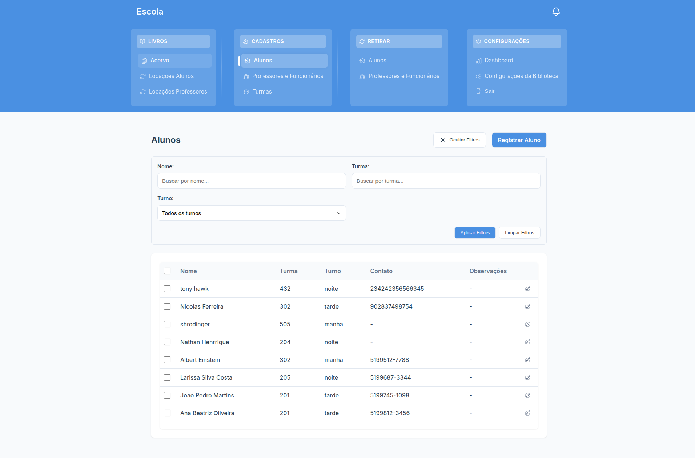
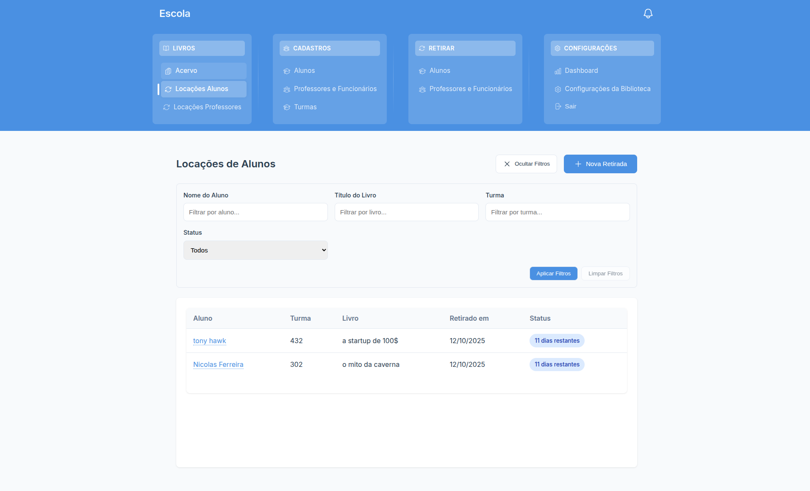
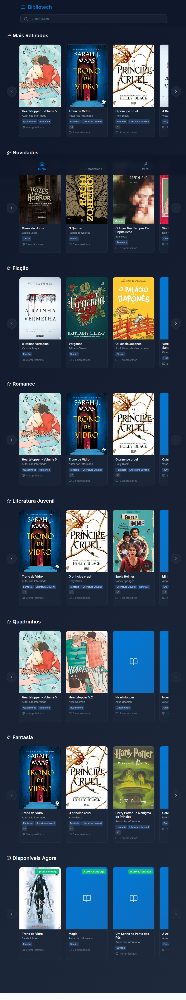

# 📚 Bibliotech - Sistema de Gestão de Biblioteca Escolar

<div align="center">

**Sistema moderno e completo para gestão de bibliotecas escolares**

[]()
[]()
[]()
[]()

</div>

---

## 🎯 Sobre o Projeto

**Bibliotech** é um sistema completo de gestão para bibliotecas escolares, desenvolvido com foco em criar uma experiência moderna e engajante tanto para gestores quanto para alunos. A plataforma oferece controle total sobre o acervo, gerenciamento de empréstimos, análises detalhadas e uma interface intuitiva para os estudantes descobrirem novos livros.

### 💡 O Problema que Resolvemos

Bibliotecas escolares tradicionalmente enfrentam desafios como:
- Controle manual de empréstimos e devoluções
- Dificuldade em analisar dados de leitura dos alunos
- Falta de engajamento dos estudantes com o acervo
- Processos burocráticos e demorados

**Bibliotech** digitaliza e automatiza todos esses processos, criando uma experiência fluida e moderna.

---

## 🖼️ Interface do Sistema

### Página Inicial
A landing page apresenta o sistema e suas funcionalidades de forma clara e atrativa:



### Seleção de Tipo de Usuário
Sistema com dois tipos de acesso: alunos (via ID estudantil) e gestores (via login):



### Dashboard Administrativo
Dashboard completo com métricas em tempo real, gráficos interativos e análises de desempenho:



**Métricas disponíveis:**
- Total de livros emprestados atualmente
- Devoluções pendentes e atrasadas
- Total de livros no acervo
- Leitores registrados e ativos
- Gráficos de empréstimos por categoria
- Ranking de livros mais populares
- Evolução mensal de empréstimos
- Progresso médio de leitura
- Ranking de alunos por pontos de leitura
- Desempenho por turma

### Catálogo de Livros
Gestão completa do acervo com busca avançada, filtros e visualização detalhada:



**Funcionalidades do catálogo:**
- Busca por título, autor, ISBN ou categoria
- Filtros por disponibilidade, categoria e nível educacional
- Sistema de tags para organização
- Informações detalhadas de cada livro (autor, editora, ano, sinopse)
- Controle de quantidade disponível
- Upload de imagens de capa
- Edição e exclusão com confirmações

### Gestão de Alunos
Controle completo dos estudantes cadastrados no sistema:



**Informações gerenciadas:**
- Nome completo do aluno
- Turma e turno
- Informações de contato
- Observações importantes
- Filtros por nome, turma e turno

### Sistema de Empréstimos
Gestão eficiente de todas as locações ativas e devolvidas:



**Controle de empréstimos:**
- Visualização de todas as locações ativas
- Informações de aluno, turma e livro emprestado
- Data de retirada e prazo restante
- Status visual (dias restantes / atrasado)
- Filtros por aluno, livro, turma e status
- Processo simplificado de nova retirada
- Controle automático de prazos

### Área do Aluno
Interface moderna e intuitiva para os estudantes explorarem o acervo:



**Funcionalidades para alunos:**
- Recomendações personalizadas de livros
- Sistema de busca intuitivo
- Visualização de livros mais populares
- Seções organizadas (novidades, mais retirados, disponíveis)
- Sistema de navegação por abas
- Interface responsiva e atrativa

---

## ✨ Principais Funcionalidades

### 👥 Sistema de Autenticação Dual

#### Para Gestores
- **Login com email e senha** via Firebase Auth
- **Recuperação de senha** automática
- **Proteção de rotas** baseada em permissões
- **Sessões persistentes** com refresh automático
- **Modo convidado** para demonstrações

#### Para Alunos
- **Acesso via ID estudantil** único
- **Interface simplificada** sem necessidade de senha
- **Validação automática** de matrícula ativa

### 📚 Gerenciamento Completo de Acervo

- **Cadastro detalhado** de livros com ISBN, autor, editora, ano, sinopse
- **Sistema de busca avançada** com múltiplos filtros
- **Categorização inteligente** com tags e gêneros
- **Níveis educacionais** para organização por série
- **Controle de estoque** e disponibilidade em tempo real
- **Upload de imagens** para capas dos livros
- **Edição e exclusão** com confirmações de segurança

### 👨‍🎓 Gestão de Estudantes

- **Cadastro completo** com nome, turma, turno e contato
- **Vinculação automática** por turma e série
- **Histórico individual** de empréstimos e leituras
- **Sistema de pontuação** baseado em leituras completas e parciais
- **Filtros avançados** para localização rápida

### 🔄 Sistema de Empréstimos Automatizado

- **Workflow completo** de retirada e devolução
- **Controle automático de prazos** (padrão: 14 dias)
- **Notificações visuais** de status (ativo/atrasado/devolvido)
- **Progresso de leitura** rastreável pelo aluno
- **Histórico detalhado** de todas as transações
- **Renovação** disponível diretamente pelo gestor

### 📈 Analytics e Relatórios Detalhados

- **Dashboard executivo** com KPIs em tempo real
- **Gráficos interativos** usando Chart.js
- **Empréstimos por categoria** com visualização visual
- **Livros mais populares** rankiados por quantidade de empréstimos
- **Evolução mensal** de empréstimos e devoluções
- **Progresso médio de leitura** dos alunos
- **Ranking de alunos** por pontos de leitura
- **Desempenho por turma** para análise educacional

### 🎯 Área Personalizada para Alunos

- **Recomendações inteligentes** baseadas em:
  - Livros mais retirados da escola
  - Novidades no acervo
  - Livros disponíveis para empréstimo imediato
- **Sistema de busca** rápido e eficiente
- **Visualização atrativa** com capas dos livros
- **Informações detalhadas** de cada título
- **Interface gamificada** para incentivar a leitura
- **Navegação por abas** (Início, Explorar, Perfil)

### 🎨 Interface Moderna e Responsiva

- **Design responsivo** para desktop, tablet e mobile
- **Animações fluidas** com Framer Motion
- **Sistema de cores profissional** sem uso excessivo de emojis
- **Loading states** e skeleton screens para melhor UX
- **Feedback visual** para todas as ações do usuário
- **Navegação intuitiva** com breadcrumbs e menus claros

---

## 🛠️ Stack Tecnológica

### Frontend
- **React 18** - Framework principal com hooks modernos
- **TypeScript** - Tipagem estática para maior confiabilidade
- **CSS Modules** - Estilização modular e isolada
- **Framer Motion** - Animações e transições fluidas
- **Chart.js + React-Chartjs-2** - Visualização de dados
- **React Router v6** - Roteamento com lazy loading
- **Lucide React** - Ícones modernos e consistentes
- **Date-fns** - Manipulação eficiente de datas

### Backend & Infraestrutura
- **Firebase v10** - Backend as a Service completo
- **Firestore** - Banco de dados NoSQL escalável
- **Firebase Auth** - Autenticação segura
- **Firebase Storage** - Armazenamento de imagens
- **Firebase Security Rules** - Regras de segurança granulares
- **Vercel** - Deploy e hosting otimizado

### Arquitetura e Padrões
- **Context API** - Gerenciamento de estado global
- **Custom Hooks** - Lógica reutilizável (20+ hooks personalizados)
- **Component Composition** - Componentes modulares e reutilizáveis
- **Lazy Loading** - Carregamento sob demanda de páginas
- **Code Splitting** - Otimização de performance
- **Cache Strategy** - Sistema de cache local para melhor performance

---

## 🚀 Como Executar o Projeto

### Pré-requisitos

```bash
Node.js 18+ 
npm 9+ ou yarn 1.22+
Git
Conta Firebase (plano gratuito disponível)
```

### Instalação

1. **Clone o repositório**
```bash
git clone https://github.com/seu-usuario/bibliotech.git
cd bibliotech
```

2. **Instale as dependências**
```bash
npm install
# ou
yarn install
```

3. **Configure o Firebase**

- Acesse o [Firebase Console](https://console.firebase.google.com)
- Crie um novo projeto
- Ative os seguintes serviços:
  - Authentication (Email/Password)
  - Firestore Database
  - Storage

4. **Configure as variáveis de ambiente**

Crie um arquivo `.env.local` na raiz do projeto:

```env
REACT_APP_FIREBASE_API_KEY=sua_api_key
REACT_APP_FIREBASE_AUTH_DOMAIN=seu_projeto.firebaseapp.com
REACT_APP_FIREBASE_PROJECT_ID=seu_projeto_id
REACT_APP_FIREBASE_STORAGE_BUCKET=seu_projeto.appspot.com
REACT_APP_FIREBASE_MESSAGING_SENDER_ID=123456789
REACT_APP_FIREBASE_APP_ID=sua_app_id
```

5. **Execute o projeto em desenvolvimento**
```bash
npm start
# ou
yarn start
```

6. **Acesse a aplicação**
```
http://localhost:3000
```

### Build para Produção

```bash
npm run build
# ou
yarn build
```

Os arquivos otimizados serão gerados na pasta `build/`.

---

## 📁 Estrutura do Projeto

```
src/
├── components/              # Componentes reutilizáveis
│   ├── auth/               # Autenticação e rotas protegidas
│   ├── dashboard/          # Componentes do dashboard administrativo
│   ├── student/            # Componentes da área do aluno
│   ├── ui/                 # Componentes base (Button, Modal, Loading)
│   ├── layout/             # Layout e navegação
│   ├── shared/             # Componentes compartilhados
│   └── recommendations/    # Sistema de recomendações
├── pages/                  # Páginas da aplicação
│   ├── Home.tsx           # Landing page pública
│   ├── auth/              # Login e seleção de usuário
│   ├── books/             # Gestão do acervo
│   ├── students/          # Gestão de alunos
│   ├── staff/             # Gestão de funcionários
│   ├── loans/             # Sistema de empréstimos
│   ├── classes/           # Gestão de turmas
│   ├── dashboard/         # Dashboard administrativo
│   ├── settings/          # Configurações do sistema
│   └── student/           # Área do aluno (home, perfil, livros)
├── contexts/              # Context API
│   ├── AuthContext.tsx    # Autenticação global
│   ├── SettingsContext.tsx # Configurações da escola
│   ├── TagsContext.tsx     # Tags do sistema
│   └── ...                # Outros contextos
├── hooks/                 # Custom hooks (20+)
│   ├── useStudentHomeCache.ts
│   ├── useStudentProfileCache.ts
│   ├── useDashboardCache.ts
│   ├── useOptimizedSearch.ts
│   └── ...
├── services/              # Serviços e APIs
│   ├── firebase.ts        # Configuração do Firebase
│   ├── studentService.ts  # Lógica de alunos
│   ├── bookRecommendationService.ts
│   ├── catalogCacheService.ts
│   └── ...
├── types/                 # Definições TypeScript
│   ├── common.ts
│   ├── educationalLevel.ts
│   └── ...
├── styles/                # Estilos globais e tema
│   ├── global.css
│   ├── theme.ts
│   └── ThemeProvider.tsx
└── config/                # Configurações
    ├── firebase.ts
    └── routes.tsx
```

---

## 🔒 Segurança

- **Autenticação Firebase** com suporte a múltiplos provedores
- **Regras de segurança** configuradas no Firestore
- **Validação de inputs** em todas as entradas de usuário
- **Proteção de rotas** baseada em autenticação
- **Sanitização** de dados antes de salvar no banco
- **HTTPS obrigatório** em produção via Vercel

---

## 🚀 Deploy

### Vercel (Recomendado)

O projeto está otimizado para deploy na Vercel:

```bash
npm run build
npx vercel --prod
```

### Outras Plataformas

#### Netlify
```bash
npm run build
# Faça upload da pasta build/ no painel da Netlify
```

#### Firebase Hosting
```bash
npm install -g firebase-tools
firebase login
firebase init hosting
npm run build
firebase deploy
```

---

## 📊 Performance

O Bibliotech foi desenvolvido com foco em performance:

- **Sistema de cache** inteligente para reduzir chamadas ao Firebase
- **Lazy loading** de componentes e rotas
- **Code splitting** automático
- **Otimização de imagens** e assets
- **Skeleton screens** para melhor percepção de velocidade
- **Debounce** em buscas e filtros
- **Memoização** de componentes pesados

---

## 🤝 Contribuindo

Contribuições são bem-vindas! Siga estes passos:

1. Faça um fork do projeto
2. Crie uma branch para sua feature (`git checkout -b feature/MinhaFeature`)
3. Commit suas mudanças seguindo os [padrões de commit](.github/CONTRIBUTING.md)
4. Push para a branch (`git push origin feature/MinhaFeature`)
5. Abra um Pull Request

### Padrões de Código

- Use **TypeScript** para todos os novos arquivos
- Siga o **ESLint** configurado
- Componentes devem ter **CSS Modules** isolados
- Mantenha **commits semânticos** com versionamento

---

## 📝 Roadmap

### Em Desenvolvimento
- [ ] Sistema de notificações push
- [ ] Exportação de relatórios em PDF e Excel
- [ ] Integração com WhatsApp para lembretes
- [ ] Sistema de reservas de livros
- [ ] App mobile nativo (React Native)

### Futuras Melhorias
- [ ] Sistema de multas automático
- [ ] Integração com sistemas escolares existentes
- [ ] Suporte a múltiplas bibliotecas (multi-tenancy completo)
- [ ] Sistema de gamificação expandido com conquistas
- [ ] Recomendações com IA baseadas em histórico de leitura

---

## 📄 Licença

Este projeto está sob a licença MIT. Veja o arquivo [LICENSE](LICENSE) para mais detalhes.

---

## 📞 Contato e Suporte

### Desenvolvedor
**Gustavo Almeida** - Desenvolvedor Full Stack

### Empresa
**Proton Software**
- 📧 Email: proton.hello.world@gmail.com
- 📞 WhatsApp: (51) 99718-8572
- 🌐 Website: [protonsoftware.tech](https://protonsoftware.tech)
- 💼 LinkedIn: [Proton Software](https://www.linkedin.com/company/107289200/)

### Demonstração
Para solicitar uma demonstração ao vivo do sistema, entre em contato através dos canais acima.

---

## 🙏 Agradecimentos

Este projeto foi desenvolvido com dedicação para atender às necessidades reais de bibliotecas escolares, buscando digitalizar e modernizar processos que tradicionalmente são manuais e demorados.

Agradecimentos especiais às escolas que validaram o sistema e forneceram feedback valioso durante o desenvolvimento.

---

<div align="center">

**Desenvolvido com dedicação por [Gustavo Almeida](https://github.com/seu-usuario)**

**© 2025 Proton Software - Todos os direitos reservados**

⭐ **Se este projeto te ajudou ou interessou, deixe uma estrela!** ⭐

</div>
